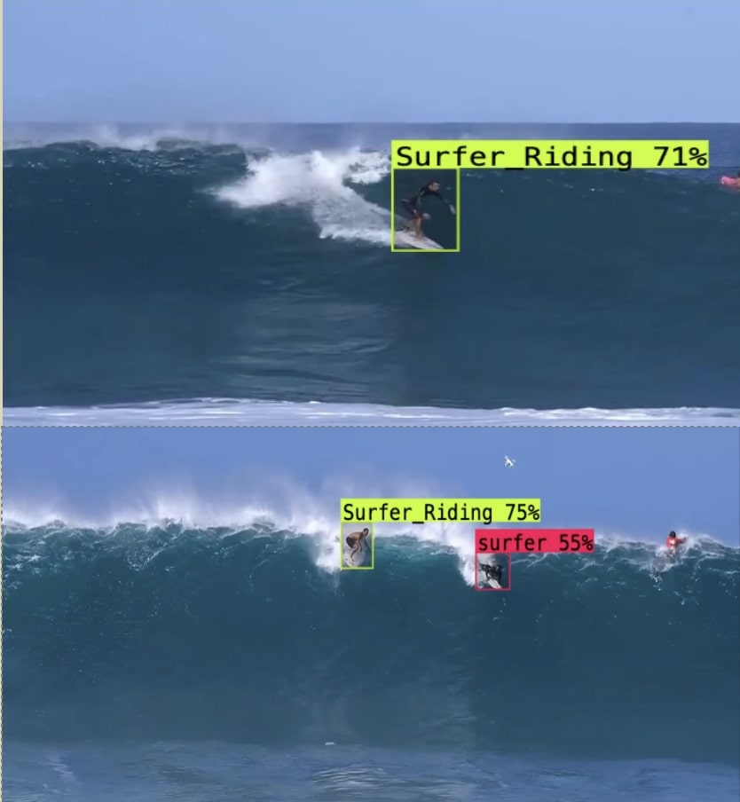

# Surf-AI

Surf AI is a web application that provides a video processing service. Users upload videos and Surf AI creates multiple highlight reels that can be viewed or shared.  ​

# How it Works​

The web application employs Ultralytics YOLOv8 technology for surf detection, distinguishing surfing vs. not surfing. The data is then used to segment reels that can be saved and shared. 

# Why is This Useful​

Recording Surf Sessions can be useful when learning to improve form and technique. The only problem is that Surf sessions can average around 3 hours and that’s too much footage to search for the parts of the surfing happening. SURF AI acts as a video editor to gather clips of the action!

# Features​

* Join/Login​

* Upload Videos​

* View Reels​

* Add Favorite Surf Spot​

* Surf Report

# Technolgies

* Python
* Django
* Ultralytics YOLOv8
